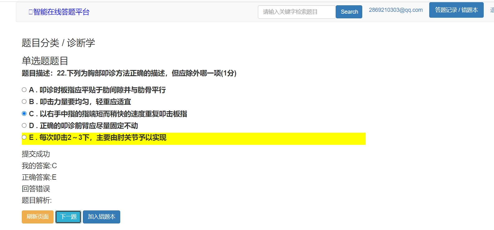

# 基于django+vue的学生在线刷题网站
## 1.项目简介
这是一个 **后端使用django框架、前端使用vue** 的学生在线答题平台，实现的功能包括
1. 使用邮箱通过**发送验证码**进行登录/注册
2. 登录后的用户可以进行答题（单选题）
3. 用户可以查看自己的**答题记录**，对**错题本**进行管理（添加/移除题目）
4. 用户可以查看每道题的**答题情况**(答题人数、正确率)
5. 本项目有一个管理后台，管理员登陆后可以对题目的标签、题目的内容进行**增删改查**
## 2.技术分析
项目使用到的技术栈
1. 后端使用django框架
2. 前端使用vue(前后端不分离)
3. 使用sqlite作为数据库(也可切换为MySQL)
4. 使用```SMPT```进行邮箱信息发送服务
## 3.怎么运行项目
运行此项目分为如下几个步骤
1. 收集静态文件
```commandline
python manage.py collectstatic
```
2. 迁移数据库
```commandline
python manage.py makemigrations
python manage.py migrate
```
注意，如果需要将数据库切换为MySQL，请在 ```settings.py```文件里面注释掉sqlite的配置，添加MySQL的配置
```python
# DATABASES = {
#     'default': {
#         'ENGINE': 'django.db.backends.sqlite3',
#         'NAME': BASE_DIR / 'db.sqlite3',
#     }
# }

# 连接MySQL数据库
DATABASES = {
    'default': {
        'ENGINE': 'django.db.backends.mysql',
        'NAME': 'wxapp',     # 需要连接的数据库名称
        'USER': 'root',      # 数据库的用户名
        'PASSWORD': 'zhao',  # 连接密码
        'HOST': '127.0.0.1', # 主机
        'PORT': '3306',      # 端口
        'OPTIONS': {
            'charset': 'utf8mb4',  # 设置编码格式
            'init_command': "SET sql_mode='STRICT_TRANS_TABLES'",
        },
    }
}
```            
3. 启动项目
```commandline
python manage.py runserver
```
也可以指定启动的端口（默认8000）
```commandline
python manage.py runserver 0.0.0.0:80
```
## 4.项目预览
1. 用户登录/注册

2. 用户答题

3. 答题记录/错题本管理

4. 管理员管理题目标签信息

5. 管理员新增题目信息

6. 管理员管理题目信息


## 5.获取帮助
```text
 @author: 我不是大佬 
 @contact: 2869210303@qq.com
 @wx; safeseaa
 @qq; 2869210303
 @time: 2023/9/30 23:35
```
**如果这些对你有帮助，请给我点上star，有任何的bug，也欢迎反馈**


